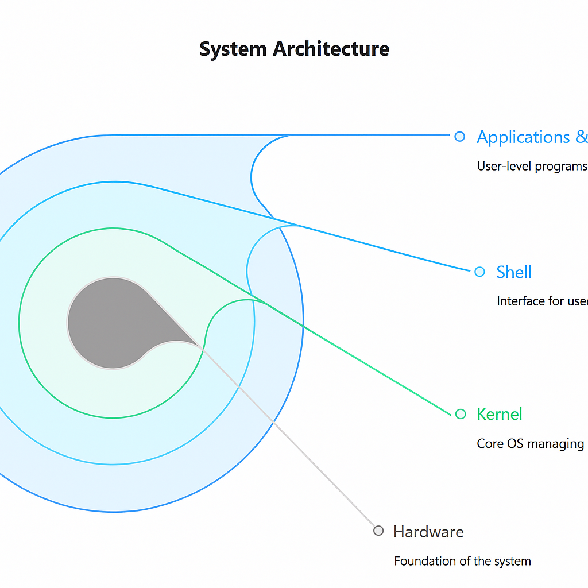

# Module 1: Introduction to Shell

## Topic 1.1: What is Shell?

*As Bhanu sat in the college computer lab, staring blankly at his screen, his classmate Sathya noticed his confusion and approached.*

**Sathya:** "Hey Bhanu, you look a bit lost. Everything okay?"

**Bhanu:** "Yeah, I'm just trying to understand what this 'shell' thing is that Professor Kumar mentioned. I know my way around basic computer stuff, but this command-line environment is completely new to me."

**Sathya:** "Ah, the shell! It's actually one of the most powerful tools you'll learn in your CS journey. Let me break it down for you."

**Bhanu:** "I'm all ears."

**Sathya:** "Imagine you're in a foreign country where you don't speak the language. You'd need an interpreter to communicate with locals, right? That's exactly what a shell is—it's the interpreter between you and your computer's operating system."

**Bhanu:** "So it's like having a direct conversation with my computer?"

**Sathya:** "Exactly! And once you learn this language, you can do things much faster and more efficiently than through point-and-click interfaces."

### Understanding the Shell

A shell serves as the fundamental interface between users and the operating system, functioning as a command interpreter that translates human-readable instructions into machine-executable operations. At its core, the shell provides a programming environment that enables users to interact with system services, execute commands, and automate tasks through scripting.

The shell operates as an essential intermediary layer in the computing architecture. When users input commands, the shell parses these instructions, communicates with the operating system kernel, and returns the results in a comprehensible format. This translation process is crucial because the kernel—the core component managing hardware resources—operates at a low level that is not directly accessible to most users.

### Linux Architecture: 

To better understand the shell's place in the computing ecosystem, consider Linux as a tall building with distinct layers:

**Foundation Layer - Hardware**  
At the bottom lies the hardware foundation—the CPU, RAM, hard disk, and network cards. These components are powerful but lack the ability to understand human language or execute high-level instructions directly.

**Control Room Layer - Kernel**  
Just above the hardware sits the kernel, functioning as the building's central control room. The kernel manages critical system operations:
- Process scheduling (like a traffic officer managing busy intersections)
- Memory management (allocating and reclaiming resources)
- Device communication (through drivers that interface with hardware)
- File system management (controlling data storage and retrieval)

Without the kernel, the hardware foundation would remain lifeless and unresponsive.

**Reception Layer - Shell**  
The shell operates as the reception desk in this architectural model. When users issue commands (such as `ls` to list files or `pwd` to display the current directory), the shell receives these instructions, interprets them, and forwards them to the kernel for execution. The kernel processes the commands and returns results through the shell to the user.

Different shells exist—Bash, Zsh, Ksh, Fish—each functioning as a "receptionist" with unique characteristics, communication styles, and capabilities.

**Application Layer - Utilities and Programs**  
The upper floors house utilities and applications—editors like vim and nano, services like Docker, web browsers, and other software tools. While these applications appear distant from the hardware foundation, they rely on the underlying layers whenever they require system resources. When applications need memory access, file operations, or device interaction, they send requests down through the shell and kernel to the hardware.

### Types of Shells

The computing ecosystem encompasses several shell implementations, each with distinct characteristics:

|Icon| Shell Name | Description | Key Features |
|---------|------------|-------------|--------------|
|| **Bash** (Bourne Again Shell) | The most prevalent shell in Linux environments | Command history, command-line editing, job control, scripting capabilities |
|| **Zsh** (Z Shell) | A modern shell with enhanced functionality | Advanced auto-completion, theme support, plugin system, improved globbing |
|| **PowerShell** | Microsoft's cross-platform object-oriented shell | Object-based piping, extensive .NET integration, structured data handling |
|| **Nushell** | A contemporary shell designed for modern data workflows | Structured data handling (JSON-like), intuitive syntax, modern data format support |

### Evolution of Shells

The development of shells reflects the evolution of computing itself, with each iteration addressing limitations of its predecessors:

**1970s — Bourne Shell (sh)**  
The first widely adopted Unix shell, establishing the foundation for command-line interaction and basic scripting capabilities. Its simplicity and reliability made it the standard for early Unix systems.

**1989 — Bash (Bourne Again Shell)**  
Developed by Brian Fox for the GNU Project, Bash enhanced the Bourne shell with significant improvements:
- Command history functionality
- Command-line editing capabilities
- Job control for process management
- Enhanced scripting features
Bash quickly became the default shell on most Linux distributions and remains the most widely used shell today.

**Early 1990s — KornShell (ksh)**  
Created by David Korn at AT&T, KornShell combined the reliability of the Bourne shell with advanced programming features like built-in arithmetic operations and associative arrays, gaining popularity in enterprise environments.

**1990 — Z Shell (zsh)**  
Zsh introduced numerous interactive enhancements:
- Intelligent auto-completion
- Advanced pattern matching (globbing)
- Customizable themes and plugins
- Built-in spelling correction
Over time, Zsh became favored by developers seeking extensive customization options.

**2000s — Fish (Friendly Interactive Shell)**  
Fish prioritized user experience with innovative features:
- Real-time autosuggestions
- Syntax highlighting
- Simplified configuration
- User-friendly scripting syntax
This shell focused on making command-line interaction more intuitive and accessible.

**2016 — PowerShell on Linux**  
Originally developed for Windows, Microsoft made PowerShell cross-platform, introducing:
- Object-based piping instead of text streams
- Robust automation capabilities
- Unified management across Windows and Linux environments
- Integration with modern APIs and services

**2020s — Modern Enhancements**  
Recent developments include:
- Community frameworks like Oh My Zsh and Starship Prompt enhancing shell customization
- Growing popularity of Zsh and Fish among developers
- Emergence of Nushell, which treats all data as structured information (similar to JSON)
- Focus on developer experience and modern data handling capabilities

Today's shell landscape offers diverse options catering to different needs: Bash remains the reliable default, Zsh dominates among customization enthusiasts, Fish appeals to those prioritizing simplicity, PowerShell serves cross-platform administrators, and Nushell represents the future of data-centric shell interaction.

## Topic 1.2: Shell vs Terminal vs Bash

*The following day, Bhanu met Sathya at the campus coffee shop, continuing their discussion about command-line tools.*

**Bhanu:** "I was practicing with the shell last night, but I kept seeing references to 'terminal' and 'Bash' too. Are they all the same thing?"

**Sathya:** "Great question! They're related but definitely not the same. Let me explain using our building analogy."

**Bhanu:** "I'm ready to learn."

### The Terminal: Your Interface to the System

A terminal is a textual input/output interface that facilitates user interaction with the operating system. Historically, terminals were physical hardware devices connected to mainframe computers. In modern computing, terminals are software applications known as terminal emulators that replicate this functionality.

The terminal serves as the presentation layer, handling the display of information and capturing user input. It does not interpret or process commands but provides a standardized environment for command-line interaction.

**Technical Characteristics**  
- **Display Management**: Renders text output, including colors, formatting, and cursor positioning
- **Input Handling**: Captures keyboard input and transmits it to the shell
- **Session Management**: Maintains the connection state between the user and the system
- **Emulation Standards**: Implements protocols such as VT100, ANSI, or XTerm to ensure compatibility

**Common Implementations**  
- **GNOME Terminal**: Default terminal for GNOME desktop environments
- **iTerm2**: Advanced terminal emulator for macOS with enhanced features
- **Windows Terminal**: Modern terminal application for Windows with tab support
- **Konsole**: Terminal emulator for the KDE desktop environment
- **xterm**: Classic terminal emulator for the X Window System

### The Shell: The Command Interpreter

A shell is a command-line interpreter that provides access to an operating system's services. It accepts commands from the user (via the terminal) and executes them by making system calls to the operating system kernel. The shell also provides a programming environment with features such as variables, control structures, and functions.

The shell functions as the processing layer, translating human-readable instructions into machine-executable operations.

**Core Functionality**  
- **Command Interpretation**: Parses and executes user commands
- **Process Management**: Creates, controls, and terminates processes
- **Environment Management**: Maintains environment variables and configuration settings
- **Input/Output Redirection**: Manages data streams between processes and files
- **Scripting Capabilities**: Supports programming constructs for automation

**Types of Shells**  
- **Bourne Shell (sh)**: The original Unix shell with basic scripting capabilities
- **C Shell (csh)**: Shell with C-like syntax and enhanced interactive features
- **KornShell (ksh)**: Combines features of Bourne and C shells with additional enhancements
- **Z Shell (zsh)**: Feature-rich shell with advanced customization capabilities
- **Bash (Bourne Again Shell)**: Enhanced version of the Bourne shell with numerous additional features

### Bash: A Specific Shell Implementation

Bash (Bourne Again Shell) is a specific Unix shell implementation written by Brian Fox for the GNU Project as a free software replacement for the Bourne shell. Released in 1989, Bash has become the default shell on most Linux distributions and was the default shell on macOS until recently.

Bash combines the features of its predecessors with numerous enhancements, making it a powerful tool for both interactive use and scripting. It maintains backward compatibility with the Bourne shell while introducing new features for improved usability and functionality.

**Key Features**  
- **Command-Line Editing**: Supports Emacs and Vi-style editing modes
- **Command History**: Maintains a history of executed commands with search capabilities
- **Job Control**: Manages foreground and background processes
- **Directory Stack**: Allows navigation between multiple directories
- **Brace Expansion**: Generates arbitrary strings using patterns
- **Arrays**: Supports indexed and associative arrays
- **Arithmetic Evaluation**: Performs integer arithmetic operations
- **Programmable Completion**: Customizes command completion behavior

---

---
### Key Differences: Terminal vs Shell vs Bash

| Aspect | Terminal | Shell | Bash |
|--------|----------|-------|------|
| **Primary Role** | User interface for textual I/O | Command interpreter and programming environment | Specific implementation of a shell |
| **Function** | Displays output and captures input | Parses and executes commands | Provides specific shell features and syntax |
| **Abstraction Layer** | Presentation layer | Processing layer | Implementation layer |
| **Dependency** | Requires a shell to function meaningfully | Requires an operating system kernel | Requires a terminal for interactive use |
| **Variability** | Multiple implementations with similar function | Multiple types with different syntax/features | Specific implementation with defined features |
| **Customization** | Appearance, behavior, keyboard shortcuts | Environment, aliases, functions, variables | All shell features plus Bash-specific options |

### When to Use Each Component

**Terminal Usage Scenarios**  
The terminal is your interface of choice when:
- You need to interact with a shell or command-line application
- You require multiple command-line sessions (via tabs or panes)
- You need to connect to remote systems via SSH or Telnet
- You want to customize your command-line environment's appearance
- You're working with applications that require a text-based interface

**Best Practices for Terminals**:
- Choose a terminal with features matching your workflow (e.g., tabs, split panes, search)
- Customize appearance for readability (font size, color schemes)
- Learn keyboard shortcuts to improve efficiency

**Shell Usage Scenarios**  
The shell is your tool of choice when:
- You need to execute commands or run applications
- You're writing scripts to automate tasks
- You require process management capabilities
- You need to manipulate environment variables
- You're working with system administration tasks

**Best Practices for Shells**:
- Learn the basic syntax and common commands
- Understand input/output redirection and piping
- Master job control for managing multiple processes
- Use shell features like aliases and functions to streamline your workflow

**Bash Usage Scenarios**  
Bash is your preferred shell when:
- You need maximum compatibility across Linux systems
- You're writing complex scripts that require advanced features
- You need to maintain backward compatibility with existing scripts
- You require a shell with extensive documentation and community support
- You're working in an environment where Bash is the default shell

**Best Practices for Bash**:
- Leverage Bash-specific features like brace expansion and arrays
- Use Bash's programmable completion for efficiency
- Follow Bash scripting best practices for maintainability
- Consider portability when writing scripts that might run on systems without Bash

### Conclusion

*As their coffee break came to an end, Bhanu felt much more confident about his understanding of command-line tools.*

**Bhanu:** "So let me make sure I've got this straight. The terminal is my window into the system, the shell is what processes my commands, and Bash is a specific type of shell that's widely used."

**Sathya:** "You've got it perfectly! And understanding these differences is crucial for becoming proficient with the command line. The terminal is your dashboard, the shell is your engine, and Bash is a particularly powerful and widely adopted version of that engine."

**Sathya:** "For most people, Bash provides the best balance of power, compatibility, and usability. But as you advance, you might explore other shells like Zsh for its customization or Fish for its user-friendliness. The terminal you choose is mostly about personal preference and workflow needs."

**Bhanu:** "Thanks, Sathya. I feel like I have a much better foundation now. I'm excited to start practicing with the shell."

**Sathya:** "That's the spirit! Remember, this is a journey. Even the most experienced system administrators are still learning new tricks. The important thing is to start with the fundamentals and build from there. And don't worry—I'll be around to help if you get stuck."

The terminal, shell, and Bash represent distinct yet interconnected components of the command-line computing experience. The terminal serves as the user interface (the dashboard), the shell acts as the command interpreter (the engine), and Bash provides a specific implementation of that engine with enhanced features.

Understanding these differences is crucial for effective command-line usage. For most users, Bash provides an excellent balance of power, compatibility, and usability. However, the choice of shell should be guided by specific needs and preferences, while the terminal selection can be based on personal workflow requirements.

By mastering these components and their relationships, you unlock the full potential of command-line computing, enabling efficient system interaction, powerful automation, and precise control over your computing environment.