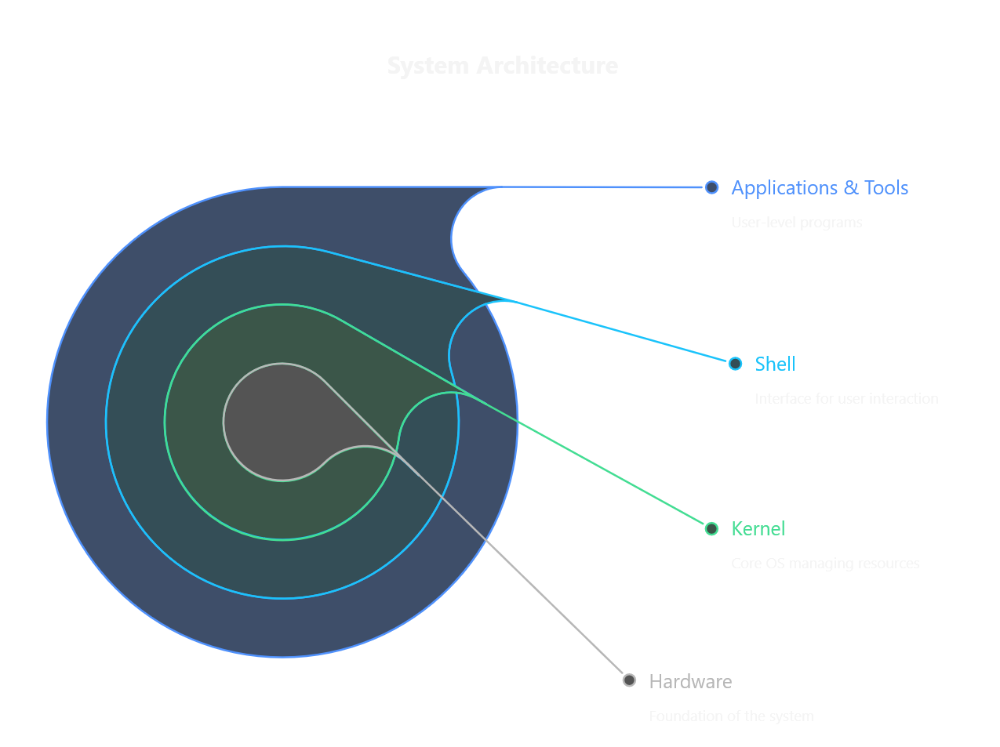

# Module 1: Introduction to Shell and Environment Setup

## Topic 1.1: What is Shell?

### Understanding the Shell

A shell is like a translator between you and your computer's operating system. Imagine you're in a foreign country and don't speak the language - you'd need an interpreter to communicate with locals. Similarly, the shell interprets your commands so the computer can understand and execute them.

### **Linux Architecture (Layered View)**

1. **Hardware (Bottom Layer)**
   * This is the **physical part** of the computer: CPU, RAM, hard disk, network cards, etc.
   * It doesn’t understand human instructions directly.

---

2. **Kernel (Core of the OS)**
   * The  **kernel is the heart of Linux** .
   * It is a piece of software that sits directly above the hardware.
   * Its main responsibilities are:
     * **Process management** → Scheduling and running processes.
     * **Memory management** → Allocating and freeing memory.
     * **Device management** → Communicating with I/O devices via drivers.
     * **File system management** → Handling how data is read/written.
   * Think of it as the  **bridge between hardware and software** .

---

3. **Shell (Command Interpreter)**
   * The  **shell is not the kernel** —it is a **user interface** to the kernel.
   * When you type a command (like `ls` or `pwd`), the shell takes that input, sends it to the kernel, and then displays the output back to you.
   * Examples of shells:  **Bash, Zsh, Ksh, Fish** .
   * It acts like a **translator** between you (the user) and the kernel.

---

4. **Utilities & Applications (User Space)**
   * These are the **programs and tools** you use daily, such as `vim`, `nano`, `docker`, browsers, etc.
   * They run **on top of the shell** and interact with the kernel when needed.

---

### **Simple Diagram (Conceptual)**

# Types of Shells

| Icon | Shell Name                                      | Description                                                                                                                                                                                                                                           |
| ---- | ----------------------------------------------- | ----------------------------------------------------------------------------------------------------------------------------------------------------------------------------------------------------------------------------------------------------- |
|    | Bash (Bourne Again Shell)                       | The most common shell, like English - widely spoken and understood everywhere                                                                                                                                                                         |
|  | Zsh (Z Shell)                                   | A more modern shell with extra features, like a language with richer vocabulary                                                                                                                                                                       |
|    | PowerShell                                      | A powerful shell developed by Microsoft, now cross-platform. Unlike traditional shells that work with text, PowerShell works with objects, making it more like a structured formal language with strict grammar rules and extensive capabilities |
|    | nushell | A modern shell that treats all data as structured data (similar to JSON). Designed to work seamlessly with today's data formats, it's like a newly constructed language focused on clarity, precision, and user-friendliness                     |

### Evolution of Shells

Shells have evolved over time, similar to how languages evolve:

- 1970s: The original Bourne shell (sh) was created
- 1989: Bash was developed as an improved version
- 1990s: More advanced shells like Zsh appeared
- Today: We have user-friendly shells with colors, auto-completion, and more

---

## Topic 1.2: Shell vs Terminal vs Bash

### Understanding the Differences

Let's use a car analogy to explain these concepts:

- **Terminal**: Like the car's dashboard and controls - the physical interface you interact with
- **Shell**: Like the car's engine - the actual system that processes your commands and makes things happen
- **Bash**: Like a specific brand of engine (e.g., a V8 engine) - a particular type of shell

### When to Use Each Component

| Component          | When to Use                                       | Real-World Example                              |
| ------------------ | ------------------------------------------------- | ----------------------------------------------- |
| **Terminal** | When you need to interact with the shell          | Opening the terminal app on your computer       |
| **Shell**    | When you want to execute commands                 | Typing commands like `ls` or `cd`           |
| **Bash**     | When you need a powerful, widely-compatible shell | Writing scripts that work on most Linux systems |

### Practical Example

Imagine you want to see what files are in a folder:

