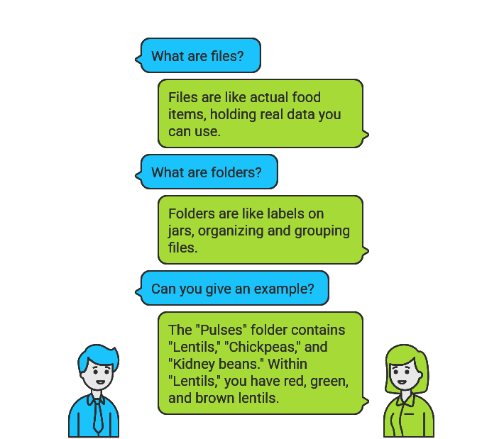

# Module 2: File Operations & Data Processing

#### In computers, everything is represented as a files, and folders are just special files that contain references to other files.



Imagine your **computer** as a **magical kingdom**  where everything —

📂  **folders** , 📄  **files** , and ⚙️ **programs** — is neatly arranged like a giant  **library** .

# GUI vs. CLI – Two Ways to Rule the Digital Kingdom

Every file has its exact home, like a map:

```
📂 C:
 └── 📂 Users
     └── 📂 app
         └── 📄 hello.txt
```

## GUI (Graphical User Interface) is like a with a colorful.

Want a new folder? 👉 Right-click → New Folder

Want to rename? 👉 Double-click, type, press Enter

Want to read a file? 👉 Double-click again

It’s simple, friendly, and visual — perfect when you’re learning or doing light tasks.

---

## CLI – The Powerful

CLI (Command Line Interface) is the wise who doesn’t waste time flipping through pages.
Instead, he speaks in precise incantations (commands):

```
cd ~/Desktop
mkdir app
cd app
echo "Hello World!" > hello.txt
cat hello.txt
```

---

## (CLI > GUI)

 **Speed** → What takes 5 clicks in GUI can be 1 command in CLI.

 **Automation** → You can script repetitive tasks, saving hours of work.

 **Precision** → No guessing, no extra clicks — just exact instructions.

 **Remote Powe**r → Control servers and systems anywhere in the world with pure commands.


| **Task**                   | **GUI (Windows / Linux Desktop)**                                 | **PowerShell**                                              | **Linux (Bash)**                   |
| -------------------------------- | ----------------------------------------------------------------------- | ----------------------------------------------------------------- | ---------------------------------------- |
| Go to Desktop                    | Double-click**Desktop** icon or open **Desktop** folder     | `cd ~/Desktop`                                                  | `cd ~/Desktop`                         |
| Create a folder `app`          | Right-click →**New → Folder** → type `app`                   | `mkdir app`                                                     | `mkdir app`                            |
| Open the folder `app`          | Double-click `app` folder                                             | `cd app`                                                        | `cd app`                               |
| Create a text file `Hello.txt` | Right-click →**New → Text Document** → rename to `Hello.txt` | `New-Item -Path "Hello.txt" -ItemType File`                     | `touch Hello.txt`                      |
| Add text inside the file         | Double-click → open in**Notepad/Text Editor** → type content    | `Set-Content -Path "Hello.txt" -Value "Hello from PowerShell!"` | `echo "Hello from Linux!" > Hello.txt` |
| View file content                | Double-click to open in**Notepad/Text Editor**                    | `Get-Content Hello.txt`                                         | `cat Hello.txt`                        |

---

# Basic Shell Commands Reference for Beginners

## 1. Working with Files and Directories


# File System Navigation

| Command             | Description                                | Example & Explanation                                                                   |
| ------------------- | ------------------------------------------ | --------------------------------------------------------------------------------------- |
| `pwd`             | Show current directory path                | `pwd` → Outputs: `/home/username/Documents` (where you are now)                    |
| `cd`              | Go to home directory                       | `cd` → Takes you to your personal folder (like `/home/username`)                   |
| `cd ..`           | Go up one directory level                  | `cd ..` → If you're in `/home/username/Documents`, takes you to `/home/username` |
| `cd folder_name`  | Go to a subdirectory                       | `cd Projects` → Enters the Projects folder inside current directory                  |
| `cd /path/to/dir` | Go to a specific directory (absolute path) | `cd /var/log` → Takes you directly to the system logs folder                         |
| `cd -`            | Switch to previous directory               | `cd -` → Toggle between two directories you've used recently                         |


**Listing and Managing Files: Keeping Your Court Organized**

After learning how to navigate and create simple files, Bhanu realized something: a well-organized court is key to better training. Just like the coach ensures that every ball, hoop, and scoreboard is in place before practice, a programmer must learn to list, copy, move, and clean up files and directories.

This section teaches Bhanu the essential commands to keep his digital workspace neat and efficient.

---

### **Listing Files – Scanning the Court Before Practice**

Before the team begins drills, the coach takes a quick look around the court — making sure everything is visible and ready.

* **Command:**

  ```bash
  ls
  ```

  **Description:** List files in the current directory.
  **Example:**

  ```bash
  ls → notes.txt report.jpg music/
  ```

* **Detailed View:**

  ```bash
  ls -l
  ```

  Shows ownership, size, and timestamps — like checking each player’s stats on the roster.

* **Show Hidden Files:**

  ```bash
  ls -a
  ```

  Reveals hidden files (like `.bashrc`) — just like finding the backup players sitting quietly on the bench.

---

### **Creating Folders**

Every team needs separate spaces for different exercises. Bhanu learns to create new “training zones” (directories).

* **Command:**

  ```bash
  mkdir homework
  ```

  Creates a folder named `homework`.

* **Nested Folders:**

  ```bash
  mkdir -p school/2023/math
  ```

  Builds an entire path — like setting up courts for juniors, seniors, and specialized drills all at once.

---

### **Copying Files**

Coaches often photocopy playbooks so each player has one. In the digital world, that’s copying files.

* **Command:**

  ```bash
  cp report.txt backup/
  ```

  Copies `report.txt` into the `backup` folder, ensuring the strategies are safe.

---

### **Moving and Renaming**

Sometimes players are moved to another position, or their jersey numbers change. Similarly, files can be moved or renamed.

* **Rename:**

  ```bash
  mv oldname.txt newname.txt
  ```

  Renames a file.

* **Move:**

  ```bash
  mv project.zip ~/Documents/
  ```

  Moves `project.zip` to another folder.

---

### **Deleting Files**

Just as old basketballs or torn shoes are discarded to make space, Bhanu learns to remove unnecessary files.

* **Delete a File:**

  ```bash
  rm temp.txt
  ```

  Removes the file permanently.

* **Delete a Folder with Contents:**

  ```bash
  rm -r old_projects/
  ```

  Removes the folder and everything inside — like clearing an entire storage room.

⚠️ **Note:** Unlike the Recycle Bin, `rm` doesn’t forgive mistakes. Once deleted, it’s gone forever!

---

✅ With these commands, Bhanu now sees the command line as a coach’s clipboard: list the team, assign positions, move players around, copy drills, and retire outdated ones. His training ground (file system) is finally under control.

---


# 2. String Manipulation


---

**Turning Raw Data into Meaningful Playbooks**

As Bhanu got comfortable with files and directories, he noticed that raw data often looked messy — like an unorganized training session with no structure. Coaches don’t just collect data, they **analyze, edit, and extract insights** from it.

In this module, Bhanu learns how to use powerful tools like **sed**, **awk**, and **text utilities** to transform messy text into structured information — just like turning raw stats into a winning game plan.

---

## **Stream Editing with `sed`**

Coaches often make quick corrections on playbooks: swapping outdated drills, striking off errors, or removing irrelevant notes. That’s what `sed` (stream editor) does with text.

* **Replace Text:**

  ```bash
  sed 's/hello/world/g' greeting.txt
  ```

  Replaces all “hello” with “world”. Like updating every outdated move with a modern strategy.

* **Replace & Save Changes:**

  ```bash
  sed -i 's/error/warning/g' log.txt
  ```

  Saves changes directly into the file — similar to permanently fixing errors in the training manual.

* **Delete a Specific Line:**

  ```bash
  sed '3d' data.txt
  ```

  Removes line 3 — like cutting a weak drill from the practice sheet.

* **Delete Matching Pattern:**

  ```bash
  sed '/temp/d' config.txt
  ```

  Deletes lines containing “temp” — like removing irrelevant plays from the playbook.

---

## **Pattern Scanning with `awk`**

If `sed` is the editor’s pen, `awk` is the **statistician’s calculator**. It scans structured data and extracts exactly what you need — much like a coach analyzing points, rebounds, or assists from a game sheet.

* **Print First Column:**

  ```bash
  awk '{print $1}' names.txt
  ```

  Outputs the first word of each line — like listing just the players’ names from the roster.

* **Use a Separator:**

  ```bash
  awk -F: '{print $1}' /etc/passwd
  ```

  Splits by colon and prints first field — like separating jersey numbers from player names.

* **Sum Column Values:**

  ```bash
  awk '{sum += $3} END {print sum}' grades.txt
  ```

  Adds all values in the 3rd column — like calculating total points scored by the team.

* **Filter by Pattern:**

  ```bash
  awk '/error/ {print}' system.log
  ```

  Prints only lines containing “error” — like reviewing only missed shots in game stats.

---

## **Text Processing Utilities**

Sometimes you don’t need the full power of `sed` or `awk` — just quick edits, like counting points or changing text case.

* **Extract Column from CSV:**

  ```bash
  cut -d',' -f1 data.csv
  ```

  Shows the first column of a CSV file — like pulling only player names from a stat sheet.

* **Extract Characters:**

  ```bash
  cut -c1-5 names.txt
  ```

  Displays first 5 characters — like using jersey initials instead of full names.

* **Convert Lowercase to Uppercase:**

  ```bash
  tr 'a-z' 'A-Z' < input.txt
  ```

  Converts all text to uppercase — like shouting plays during a loud game.

* **Delete Digits:**

  ```bash
  tr -d '[:digit:]' < data.txt
  ```

  Removes all numbers — like focusing only on player names without scores.

---

✅ With `sed`, `awk`, and simple text utilities, Bhanu can now **reshape, filter, and analyze data** on the fly. His raw logs and messy files turn into polished reports, giving him the same edge a coach gets from a clean stat sheet.

---

# 3. File Permissions and Ownership


**Defining Roles and Responsibilities in the Team**

When Bhanu’s scripts started growing, he realized not everyone should have the same access. Just like a basketball team — where coaches, captains, and players have different roles — files too must respect **ownership and permissions**.

This module teaches Bhanu how to control **who can read, write, and execute files**, assign ownership, and set defaults for newly created files.

---

## **Understanding chmod – Setting the Rules of the Game**

Permissions in Linux are like deciding who can **read the playbook, edit strategies, or run drills**.

* **Set Full Permissions (rwxr-xr-x):**

  ```bash
  chmod 755 script.sh
  ```

  Makes the script executable for everyone, but writable only by the owner. Like letting everyone *practice drills*, but only the coach can *change the playbook*.

* **Add Execute Permission for Owner:**

  ```bash
  chmod u+x myprogram
  ```

  Grants the owner execution rights. Like giving the captain special authority to start a drill.

* **Remove Write for Group & Others:**

  ```bash
  chmod go-w important.txt
  ```

  Prevents group and others from editing. Like protecting the team’s strategy notes from casual changes.

* **Set Read-Only for All:**

  ```bash
  chmod a=r readonly.txt
  ```

  Everyone can read, but no one can write or execute. Like handing out a *reference-only* playbook.

---

## **Managing Ownership with chown – Assigning Responsibility**

Every file needs an owner, just as every drill has a coach responsible for it.

* **Change File Owner:**

  ```bash
  chown john report.txt
  ```

  Assigns John as the new owner. Like putting John in charge of maintaining the report.

* **Change Owner and Group:**

  ```bash
  chown mary:students project.doc
  ```

  Makes Mary the owner and “students” the group. Like appointing a lead player and assigning the supporting squad.

* **Change Ownership Recursively:**

  ```bash
  chown -R john:users /home/john
  ```

  Changes ownership of all files inside a directory. Like giving John control over his entire locker room.

---

## **umask – Setting Default Rules Before the Game Starts**

Just as coaches set **ground rules** before practice, Linux sets default permissions for new files using `umask`.

* **View Current umask:**

  ```bash
  umask
  ```

  Shows the current mask (e.g., 0022). Like checking the team’s default training policy.

* **Set New umask Value:**

  ```bash
  umask 027
  ```

  Ensures new files have permissions `rw-r----- (750)`. Like deciding only the coach and assistants can access new drills.

* **Show Symbolic umask:**

  ```bash
  umask -S
  ```

  Displays in symbolic form (e.g., `u=rwx,g=rx,o=rx`). Like spelling out the rules clearly for everyone.

---

✅ With **chmod, chown, and umask**, Bhanu now controls **who can read, edit, or execute files** — just like defining **roles and responsibilities** in a championship team.

---

# 4. Input and Output Redirection


---

Working with files and commands in Linux isn’t just about viewing or editing data—it’s about controlling where input comes from and where output goes. This is where **redirection** becomes powerful. Instead of always reading from the keyboard and writing to the screen, we can send output to files, take input from files, or even handle errors separately.

---

## Standard Output Redirection

| Command                      | Description                         | Example & Explanation                                                              |
| ---------------------------- | ----------------------------------- | ---------------------------------------------------------------------------------- |
| `command > file`             | Redirect output to file (overwrite) | `ls -l > filelist.txt` → Saves directory listing to file, overwriting if it exists |
| `command >> file`            | Redirect output to file (append)    | `date >> log.txt` → Appends current date/time to the end of log file               |
| `command \| another_command` | Pipe output to another command      | `ls -l \| grep ".txt"` → Sends `ls` output into `grep`, showing only `.txt` files  |

👉 **Key idea**: `>` overwrites, `>>` appends, and `|` pipes output to another command.

---

## Input Redirection

| Command          | Description                      | Example & Explanation                                                        |
| ---------------- | -------------------------------- | ---------------------------------------------------------------------------- |
| `command < file` | Use file as input                | `sort < names.txt` → Sorts lines from `names.txt` without modifying the file |
| `command << EOF` | Here document (multi-line input) |                                                                              |

```bash
cat << EOF > letter.txt
Hello User,
This is a sample letter.
EOF
```

Creates `letter.txt` with the given content until the `EOF` marker. |

👉 **Key idea**: Instead of typing input interactively, you can feed files or custom input blocks into a command.

---

## Error Redirection

| Command               | Description                              | Example & Explanation                                                              |
| --------------------- | ---------------------------------------- | ---------------------------------------------------------------------------------- |
| `command 2> file`     | Redirect error messages to file          | `ls /nonexistent 2> errors.txt` → Saves error message to file, not screen          |
| `command 2>> file`    | Append errors to file                    | `find / -name "secret" 2>> search_errors.log` → Appends errors to log file         |
| `command &> file`     | Redirect both output and errors          | `make &> build.log` → Saves all output and errors to `build.log`                   |
| `command > file 2>&1` | Redirect output and errors (alternative) | `ls -l /etc > listing.txt 2>&1` → Saves both normal output and errors to same file |


## Head lines

* **Standard Output**: Send results of a command to a file or another command.
* **Input Redirection**: Provide input from a file or here-document instead of the keyboard.
* **Error Redirection**: Separate or combine error messages with normal output.

---

✅ **Things to remember**

* `>` overwrites files, while `>>` appends.
* `|` pipes output to another command for further processing.
* `2>` captures errors, `&>` captures both output and errors.
* Redirection helps in **logging**, **automation**, and **error handling**.

---
# 5. Process Management

### Process Monitoring


Managing processes in Linux is like managing players during a basketball game. Each player (process) has a role, and as the coach (user), you need to monitor their performance, control their actions, and decide when to substitute or stop them.

---

## Viewing Processes

* **`ps aux`**
  Lists all running processes with details like PID, CPU, memory usage, and owner.
  **Example**:

  ```bash
  ps aux
  ```

  → Shows every program running in the system, much like checking your entire team roster during practice.

* **`top`**
  Displays a real-time, updating view of processes and their resource usage.
  **Example**:

  ```bash
  top
  ```

  → Similar to watching a live scoreboard with performance stats. Press `q` to quit.

* **`htop`** *(if installed)*
  An interactive version of `top` with colors and scrolling support.
  **Example**:

  ```bash
  htop
  ```

  → Like having a digital scoreboard where you can filter, search, and interact with player stats.

---

## Controlling Processes

* **`kill PID`**
  Stops a specific process using its PID.
  **Example**:

  ```bash
  kill 1234
  ```

  → Ends the process with ID 1234, like calling off a drill that isn’t working.

* **`kill -9 PID`**
  Forcefully stops a process that doesn’t respond to normal termination.
  **Example**:

  ```bash
  kill -9 1234
  ```

  → Immediately removes process 1234 from the system, like pulling a player off the court instantly.

* **`killall name`**
  Terminates all processes with the same name.
  **Example**:

  ```bash
  killall firefox
  ```

  → Closes all Firefox windows at once, like ending all identical drills.

* **`pkill pattern`**
  Kills processes matching a given name or pattern.
  **Example**:

  ```bash
  pkill -f "python script.py"
  ```

  → Stops all processes running the specified script, similar to ending all plays based on a particular strategy.

---

## Managing Background Jobs

* **`command &`**
  Runs a command in the background.
  **Example**:

  ```bash
  sleep 60 &
  ```

  → Starts a timer in the background, letting you keep working in the same terminal—like setting up a drill while focusing on another task.

* **`nohup command &`**
  Runs a process immune to hangups (keeps running even if you log out).
  **Example**:

  ```bash
  nohup ./long_script.sh &
  ```

  → Ensures the script continues running after logout, like letting practice continue even if the coach leaves.

* **`jobs`**
  Lists all background jobs in the current shell.
  **Example**:

  ```bash
  jobs
  ```

  → Shows active drills happening in the background.

* **`bg %1`**
  Resumes a stopped job in the background.
  **Example**:

  ```bash
  bg %1
  ```

  → Sends job number 1 to continue in the background, like restarting a paused drill without full attention.

* **`fg %1`**
  Brings a background job back to the foreground.
  **Example**:

  ```bash
  fg %1
  ```

  → Brings job number 1 back into focus, just like shifting full attention to one drill.

---

✅ With these commands, you can **monitor, control, and multitask** effectively, just like a championship coach managing drills, substitutions, and live gameplay.

---
                     

## 6. Cron Jobs and Task Automation


Perfect 👍 Here’s **Cron Jobs and Task Automation** rewritten in the same **book-style format** we’ve been using for the modules:

---

# Cron Jobs and Task Automation

Automation is what transforms good scripting into great systems. Instead of running tasks manually, Linux provides tools to schedule jobs—like creating a training calendar for your team. Just as a basketball coach sets up drills for specific times (daily shooting practice, weekly scrimmages, monthly reviews), you can schedule scripts to run daily, weekly, or even just once.

---

## Crontab Configuration

* **`crontab -e`**
  Opens the user’s cron table for editing. You can schedule recurring tasks here.
  **Example**:

  ```bash
  crontab -e
  ```

  → Opens the editor to add jobs, like scheduling your daily training routine.

* **`crontab -l`**
  Lists all scheduled jobs for the current user.
  **Example**:

  ```bash
  crontab -l
  ```

  → Displays your training calendar, showing all scheduled drills.

* **`crontab -r`**
  Removes all scheduled cron jobs for the user. *(Use with caution!)*
  **Example**:

  ```bash
  crontab -r
  ```

  → Wipes out the entire schedule, like canceling all practices at once.

* **Cron Job Syntax**
  Cron entries follow the format:

  ```
  minute hour day month weekday command
  ```

  **Example**:

  ```bash
  0 2 * * * /home/user/backup.sh
  ```

  → Runs the backup script every day at 2:00 AM, like scheduling morning drills daily.

---

## One-Time Task Scheduling with `at`

* **`at time`**
  Schedule a command to run once at a specific time.
  **Example**:

  ```bash
  at 10:30 PM
  ```

  → Prompts for commands to run at 10:30 PM today, like planning a one-time late-night training session.

* **`atq`**
  Lists pending `at` jobs waiting to run.
  **Example**:

  ```bash
  atq
  ```

  → Shows all scheduled one-time tasks, like reviewing your special events calendar.

* **`atrm jobnum`**
  Removes a scheduled `at` job by its number.
  **Example**:

  ```bash
  atrm 3
  ```

  → Cancels job number 3, like calling off a scheduled practice.

* **Quick scheduling** using `echo` and `at`:
  **Example**:

  ```bash
  echo "echo 'Training Complete'" | at now + 1 hour
  ```

  → Schedules a message to run in one hour, like setting a reminder after practice.

---

## Systemd Timers

Modern Linux systems often use **systemd timers** as an alternative to cron. They’re more powerful and integrated with system services.

* **`systemctl list-timers`**
  Lists all active timers and their next scheduled run.
  **Example**:

  ```bash
  systemctl list-timers
  ```

  → Like viewing the master schedule for every team in the league.

* **`systemctl start timer`**
  Starts a specific timer immediately.
  **Example**:

  ```bash
  systemctl start backup.timer
  ```

  → Like starting a training drill early.

* **`systemctl enable timer`**
  Ensures the timer runs automatically after reboot.
  **Example**:

  ```bash
  systemctl enable weekly-report.timer
  ```

  → Like ensuring weekly matches are always booked in advance.

* **`systemctl status timer`**
  Shows detailed information about a timer, including when it last and next runs.
  **Example**:

  ```bash
  systemctl status cleanup.timer
  ```

  → Like checking if last night’s practice actually happened and when the next one is planned.

---

✅ With **cron, at, and systemd timers**, you can schedule everything from daily backups to one-time jobs, just like a coach setting a structured training plan for maximum performance.

---

# 7. Working with Logs


Logs are the **black box recorders** of your system. They capture everything—from successful logins to failed attempts, from service starts to sudden crashes. As a system administrator, being able to read, filter, and analyze logs is like being a detective following clues.

---

## Log Monitoring

### `tail -f logfile` → Monitor logs in real-time

```bash
tail -f /var/log/syslog
```

This command keeps showing you new log entries as they are written.
👉 Imagine watching the scoreboard update live during a cricket match—every ball is logged immediately.

---

### `tail -n 100 logfile` → Show the last N lines

```bash
tail -n 100 /var/log/auth.log
```

Displays the most recent 100 lines of the log file.
👉 Useful when you just want to **catch up on the highlights** instead of replaying the whole game.

---

### `tail -f logfile | grep pattern` → Monitor with filters

```bash
tail -f /var/log/syslog | grep "error"
```

Continuously watches the log but only prints lines containing `"error"`.
👉 Like watching a live chat but only seeing messages with your name in them.

---

## Log Filtering with `grep`

### `grep pattern logfile` → Search logs

```bash
grep "failed" /var/log/auth.log
```

Finds all failed login attempts.
👉 Super handy to **spot intrusion attempts**.

---

### `grep -i pattern logfile` → Case-insensitive search

```bash
grep -i "warning" /var/log/messages
```

Finds "warning", "Warning", or even "WARNING".
👉 Because logs don’t care about grammar, and neither should you.

---

### `grep -v pattern logfile` → Exclude patterns

```bash
grep -v "debug" /var/log/app.log
```

Shows all logs except those containing `"debug"`.
👉 Like muting the chatter in a group chat and only reading the important stuff.

---

### `grep -C 3 pattern logfile` → Show context around a match

```bash
grep -C 3 "failed" /var/log/auth.log
```

Displays the matching line plus 3 lines before and after.
👉 Like watching the **instant replay** around a wicket fall.

---

## Log Parsing with `awk`

### Extract specific fields

```bash
awk '{print $1, $4}' /var/log/nginx/access.log
```

Prints the **date and IP address** from each entry.
👉 Great for quickly seeing who visited your website and when.

---

### Count occurrences

```bash
awk '/error/ {count++} END {print count}' /var/log/app.log
```

Counts how many times `"error"` appeared in the log.
👉 Like asking, “How many no-balls were there in this match?”

---

### Numeric filtering

```bash
awk '$NF > 500 {print}' response_times.log
```

Shows only requests where the **last field (response time)** is greater than 500ms.
👉 Perfect for spotting **slow pages** on your website.

---

### Parse with custom separators

```bash
awk -F: '{print $1}' /var/log/auth.log
```

Splits by `:` and prints the first field, often the **username**.
👉 Think of it like pulling only the **players’ names** from a scoreboard.

---

✅ **Power Move**: Combine `grep` + `awk` + `tail` like a pro. Example:

```bash
tail -f /var/log/nginx/access.log | grep "404" | awk '{print $7}'
```

→ Live monitors all 404 errors and shows **only the URL** that failed.

---

# 8. Additional Useful Commands


Sometimes, the commands you know aren’t enough—you’ll need help finding new ones, remembering old ones, or stopping mistakes in progress. This section covers **documentation tools, history tricks, and keyboard shortcuts** that make you feel like a Linux power user.

---

## Help and Documentation

### `man command` → Manual pages

```bash
man grep
```

Opens the full manual page for the command.
👉 Think of this as the **official rulebook**—long, but everything is in there. Press `q` to quit.

---

### `command --help` → Quick help

```bash
ls --help
```

Shows the most common options and examples.
👉 Like a **cheat sheet**—fast, simple, and often enough.

---

### `info command` → Info documentation

```bash
info coreutils
```

Provides in-depth documentation in a structured format.
👉 More detailed than `man`, almost like a **textbook** version of help.

---

### `whatis command` → Quick description

```bash
whatis cd
```

Outputs a short one-line description:

```
cd (1) - change the working directory
```

👉 Like looking up a **word definition** in a dictionary.

---

### `apropos topic` → Search for related commands

```bash
apropos "list files"
```

Finds all commands related to listing files.
👉 Imagine Googling inside your terminal.

---

## Command History and Shortcuts

### `history` → View recent commands

```bash
history
```

Lists your recent commands with numbers.
👉 Useful when you forget what you typed 5 minutes ago.

---

### `!n` → Re-run a specific command

```bash
!42
```

Re-executes the 42nd command from your history.
👉 Like hitting “replay” on a past move.

---

### `!!` → Repeat last command

```bash
!!
```

Runs the most recent command again.
👉 Perfect when you just realized you forgot `sudo`. Example:

```bash
!!  
sudo !!
```

---

### `Ctrl+R` → Search history interactively

Press `Ctrl+R` and start typing:

```
(reverse-i-search)`grep`: 
```

Shows your last command containing `"grep"`. Keep pressing `Ctrl+R` to cycle through more matches.
👉 Like **scrolling back in time** with a search filter.

---

### `Ctrl+C` → Cancel a running command

If a program hangs, press `Ctrl+C`.
👉 Like hitting the **emergency stop button**.

---

### `Ctrl+Z` → Pause a command

Suspends the process and gives you your prompt back.
👉 Like putting a video on **pause**; bring it back with:

```bash
fg
```

---

### `Tab` → Auto-completion

```bash
cd Doc<Tab>
```

Automatically completes to `Documents/` if it’s the only match.
👉 Your shell becomes a **mind reader**, saving time and typos.

---

✅ **Pro Tip**: Combine history tricks with editing. For example:

```bash
!42:p
```

Prints the command without running it—so you can copy or modify before execution.


---

# Crossing the Threshold

With Module 2, you’ve walked far enough into the shell to realize it’s no longer a collection of isolated commands, but a living environment. You’ve learned to bend files and streams, command processes, shape time with schedulers, and read the pulse of your system through logs. You’ve moved from reacting to your computer to **directing it with purpose**.

But as every explorer knows, learning to navigate the terrain is only the beginning. True mastery comes when you start weaving these pieces together—when the commands stop standing alone and instead form **scripts** that think, act, and decide on your behalf.

And that is where we now turn.

Module 3 is where the shell truly awakens: loops and conditions that breathe logic into your commands, scripts that become tools of their own, and automation that transforms one-time tricks into lasting powers. If Module 2 was about learning the language, Module 3 is about **writing stories with it**.

So take a breath, close the chapter on Module 2, and get ready—because the shell is about to evolve from a trusted companion into a **silent partner in creation**.

---
