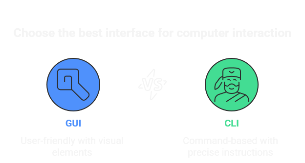

# Module 2: Scripting Fundamentals

#### In computers, everything is represented as a files, and folders are just special files that contain references to other files.


Imagine your **computer** as a **magical kingdom**  where everything —

📂  **folders** , 📄  **files** , and ⚙️ **programs** — is neatly arranged like a giant  **library** .

# GUI vs. CLI – Two Ways to Rule the Digital Kingdom

Every file has its exact home, like a map:

```
📂 C:
 └── 📂 Users
     └── 📂 app
         └── 📄 hello.txt
```

## GUI (Graphical User Interface) is like a with a colorful.

Want a new folder? 👉 Right-click → New Folder

Want to rename? 👉 Double-click, type, press Enter

Want to read a file? 👉 Double-click again

It’s simple, friendly, and visual — perfect when you’re learning or doing light tasks.

---

## CLI – The Powerful

CLI (Command Line Interface) is the wise who doesn’t waste time flipping through pages.
Instead, he speaks in precise incantations (commands):

```
cd ~/Desktop
mkdir app
cd app
echo "Hello World!" > hello.txt
cat hello.txt
```

---

## (CLI > GUI)

 **Speed** → What takes 5 clicks in GUI can be 1 command in CLI.

 **Automation** → You can script repetitive tasks, saving hours of work.

 **Precision** → No guessing, no extra clicks — just exact instructions.

 **Remote Powe**r → Control servers and systems anywhere in the world with pure commands.




| **Task**                   | **GUI (Windows / Linux Desktop)**                                 | **PowerShell**                                              | **Linux (Bash)**                   |
| -------------------------------- | ----------------------------------------------------------------------- | ----------------------------------------------------------------- | ---------------------------------------- |
| Go to Desktop                    | Double-click**Desktop** icon or open **Desktop** folder     | `cd ~/Desktop`                                                  | `cd ~/Desktop`                         |
| Create a folder `app`          | Right-click →**New → Folder** → type `app`                   | `mkdir app`                                                     | `mkdir app`                            |
| Open the folder `app`          | Double-click `app` folder                                             | `cd app`                                                        | `cd app`                               |
| Create a text file `Hello.txt` | Right-click →**New → Text Document** → rename to `Hello.txt` | `New-Item -Path "Hello.txt" -ItemType File`                     | `touch Hello.txt`                      |
| Add text inside the file         | Double-click → open in**Notepad/Text Editor** → type content    | `Set-Content -Path "Hello.txt" -Value "Hello from PowerShell!"` | `echo "Hello from Linux!" > Hello.txt` |
| View file content                | Double-click to open in**Notepad/Text Editor**                    | `Get-Content Hello.txt`                                         | `cat Hello.txt`                        |

---

# Basic Shell Commands Reference for Beginners

## 1. Directory Navigation Commands (`cd`)

| Command             | Description                                | Example & Explanation                                                                        |
| ------------------- | ------------------------------------------ | -------------------------------------------------------------------------------------------- |
| `cd`              | Go to your home directory                  | `cd` → Takes you to your personal folder (like `/home/username`)                        |
| `cd ~`            | Go to home directory (explicit)            | `cd ~` → Same as above, but explicitly uses the tilde (~) for home                        |
| `cd ..`           | Go up one directory level                  | `cd ..` → If you're in `/home/username/Documents`, this takes you to `/home/username` |
| `cd -`            | Switch to your previous directory          | `cd -` → Toggle between two directories you've used recently                              |
| `cd /path/to/dir` | Go to a specific directory (absolute path) | `cd /var/log` → Takes you directly to the system logs folder                              |
| `cd folder_name`  | Go to a subdirectory (relative path)       | `cd Documents` → From your home folder, enters your Documents folder                      |

## 2. File Listing Commands (`ls`)

| Command    | Description                                    | Example & Explanation                                                                      |
| ---------- | ---------------------------------------------- | ------------------------------------------------------------------------------------------ |
| `ls`     | List files in current directory                | `ls` → Shows basic file names like: `notes.txt report.jpg music/`                     |
| `ls -l`  | Detailed list with permissions, size, date     | `ls -l` → Shows: `-rw-r--r-- 1 user group 2048 May 15 10:30 notes.txt` (more details) |
| `ls -a`  | Show all files including hidden ones           | `ls -a` → Reveals hidden files like `.bashrc` and `.config` (starting with dot)     |
| `ls -la` | Detailed list including hidden files           | `ls -la` → Combines both `-l` and `-a` for complete details                         |
| `ls -lh` | Detailed list with human-readable sizes        | `ls -lh` → Shows sizes as `4.0K`, `2.1M`, `3.5G` instead of bytes                 |
| `ls -t`  | Sort files by modification time (newest first) | `ls -lt` → Shows most recently changed files at the top                                 |
| `ls -R`  | List files in all subdirectories recursively   | `ls -R` → Shows contents of current folder AND all folders inside it                    |

## 3. File Operations

| Command            | Description                           | Example & Explanation                                                                                             |
| ------------------ | ------------------------------------- | ----------------------------------------------------------------------------------------------------------------- |
| `touch file.txt` | Create empty file or update timestamp | `touch homework.txt` → Creates a new empty file named "homework.txt"                                           |
| `cp src dest`    | Copy files or folders                 | `cp notes.txt backup/` → Copies "notes.txt" to the "backup" folder                                             |
| `mv src dest`    | Move or rename files/folders          | `mv oldname.txt newname.txt` → Renames the file `<br>mv project.zip ~/Documents/` → Moves file to Documents |
| `rm file.txt`    | Delete files permanently              | `rm temp.txt` → Deletes "temp.txt" (cannot be undone!)                                                         |
| `rm -r dir`      | Delete folders and everything inside  | `rm -r old_projects/` → Deletes the entire folder and its contents                                             |
| `mkdir dir`      | Create new directory                  | `mkdir photos` → Creates a new folder named "photos"                                                           |
| `mkdir -p path`  | Create nested directories             | `mkdir -p school/2023/math` → Creates all parent folders as needed                                             |

## 4. Viewing File Contents

| Command               | Description                 | Example & Explanation                                                  |
| --------------------- | --------------------------- | ---------------------------------------------------------------------- |
| `cat file.txt`      | Display entire file content | `cat story.txt` → Shows the whole story on your screen              |
| `less file.txt`     | View file page by page      | `less novel.txt` → Use arrow keys to navigate, type 'q' to quit     |
| `head -n 5 file`    | Show first 5 lines of file  | `head -n 5 class_roster.txt` → Shows just the first 5 lines         |
| `tail -n 5 file`    | Show last 5 lines of file   | `tail -n 5 server_log.txt` → Shows the most recent 5 entries        |
| `grep pattern file` | Search for text in files    | `grep "error" system_log.txt` → Shows only lines containing "error" |

## 5. System Information

| Command        | Description                        | Example & Explanation                                                        |
| -------------- | ---------------------------------- | ---------------------------------------------------------------------------- |
| `pwd`        | Show current directory path        | `pwd` → Outputs: `/home/username/Documents/essays` (where you are now)  |
| `whoami`     | Show your current username         | `whoami` → Outputs: `student123` (your login name)                      |
| `date`       | Show current date and time         | `date` → Outputs: `Tue May 16 14:30:45 EDT 2023`                        |
| `cal`        | Display calendar for current month | `cal` → Shows a simple calendar of the current month                      |
| `df -h`      | Show disk space usage              | `df -h` → Shows how much space is left on your drives (in GB/MB)          |
| `du -sh dir` | Show folder size                   | `du -sh Downloads/` → Outputs: `2.5G Downloads/` (total size of folder) |

## 6. Process Management

| Command          | Description                           | Example & Explanation                                                          |
| ---------------- | ------------------------------------- | ------------------------------------------------------------------------------ |
| `ps aux`       | List all running processes            | `ps aux` → Shows all programs currently running with details like CPU usage |
| `top`          | Monitor system processes in real-time | `top` → Live updating list of processes (press 'q' to quit)                 |
| `kill PID`     | Stop a running process                | `kill 1234` → Stops process with ID 1234 (find PID with `ps` or `top`)  |
| `killall name` | Stop all processes with a given name  | `killall firefox` → Closes all Firefox windows                              |
| `jobs`         | List background jobs                  | `jobs` → Shows programs running in the background                           |
| `bg %1`        | Run a stopped job in background       | `bg %1` → Sends job number 1 to run in background                           |
| `fg %1`        | Bring a background job to foreground  | `fg %1` → Brings job number 1 back to your active terminal                  |

## 7. Permissions & Ownership

| Command                   | Description                      | Example & Explanation                                                               |
| ------------------------- | -------------------------------- | ----------------------------------------------------------------------------------- |
| `chmod 755 file`        | Change file permissions          | `chmod 755 script.sh` → Makes script executable (owner=rwx, others=rx)           |
| `chmod u+x file`        | Add execute permission for owner | `chmod u+x myprogram` → Allows you to run the program                            |
| `chown user:group file` | Change file owner and group      | `chown mary:students report.txt` → Makes Mary the owner and "students" the group |
| `chgrp group file`      | Change group ownership           | `chgrp faculty research.docx` → Sets the group to "faculty"                      |

## 8. Help Commands

| Command            | Description                        | Example & Explanation                                                                 |
| ------------------ | ---------------------------------- | ------------------------------------------------------------------------------------- |
| `man command`    | Open manual page for a command     | `man ls` → Shows detailed documentation for the `ls` command (press 'q' to exit) |
| `command --help` | Get quick help for a command       | `grep --help` → Shows common options and usage examples for `grep`               |
| `info command`   | View detailed info documentation   | `info coreutils` → Shows in-depth documentation for core utilities                 |
| `whatis command` | Get brief description of a command | `whatis cd` → Outputs: "cd - change the working directory"                         |
| `apropos topic`  | Find commands related to a topic   | `apropos "list files"` → Shows commands related to listing files                   |

## 9. History & Shortcuts

| Command     | Description                          | Example & Explanation                                                                |
| ----------- | ------------------------------------ | ------------------------------------------------------------------------------------ |
| `history` | Show your command history            | `history` → Lists your recent commands with numbers                               |
| `!n`      | Re-run command number n from history | `!42` → Re-executes the 42nd command in your history                              |
| `!!`      | Re-run your last command             | `!!` → Repeats the exact command you just ran                                     |
| `Ctrl+R`  | Search through command history       | `Ctrl+R` then type "grep" → Finds your last command containing "grep"             |
| `Ctrl+C`  | Cancel current command               | `Ctrl+C` → Stops a running command (like a long search)                           |
| `Ctrl+Z`  | Pause current command                | `Ctrl+Z` → Suspends a process so you can do something else (use `fg` to resume) |
| `Tab`     | Auto-complete file/directory names   | `cd Doc<Tab>` → Automatically completes to `cd Documents/` if unique            |

## 10. Networking Commands

| Command           | Description                           | Example & Explanation                                                                |
| ----------------- | ------------------------------------- | ------------------------------------------------------------------------------------ |
| `ping host`     | Test connection to a website/server   | `ping google.com` → Sends test packets to Google and shows response time          |
| `curl URL`      | Download content from a website       | `curl https://example.com` → Shows the HTML code of the webpage                   |
| `wget URL`      | Download files from the web           | `wget https://example.com/file.zip` → Downloads the file to current directory     |
| `ssh user@host` | Connect to a remote computer          | `ssh student@university.edu` → Logs you into a remote server                      |
| `scp src dest`  | Securely copy files between computers | `scp report.txt student@university.edu:~/` → Copies file to remote home directory |
